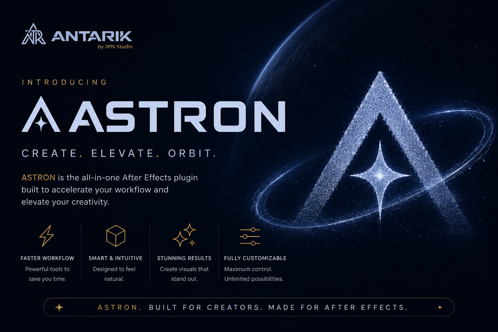

<p align="center">
  
</p>

<h1 align="center">⚡ Astron</h1>
<h3 align="center">After Effects Power Extension</h3>

<p align="center">
  <strong>100+ commands • 12 modules • AI-powered • One keyboard shortcut</strong>
</p>

<p align="center">
  
  
  
  
  
</p>

<p align="center">
  <em>Built by <a href="https://antarik.co">Antarik by JPN STUDIO</a> • Bundle ID: <code>co.antarik.astron</code></em>
</p>

---

## 🎯 What is Astron?

**Astron** is a professional Adobe CEP plugin that transforms After Effects into a command-driven powerhouse. Instead of clicking through menus, hunting for effects, or switching between 20 different tools — just press `Ctrl/⌘ + Space` and type what you want.

```
/ease overshoot          → Apply overshoot easing to selected keyframes
/stagger 100ms           → Stagger selected layers by 100ms
/camera orbit            → Create an orbital camera rig
/grade cinematic         → Apply cinematic color grading
/beats                   → Detect BPM and drop timeline markers
"make this text bounce"  → AI understands and executes
```

> **One panel. 100+ commands. Zero menu diving.**

Astron indexes every native AE effect, every installed third-party plugin, AE animation presets, local user presets, and all 100+ built-in commands under a single fuzzy search bar. If you can describe it, Astron can find it and run it.

---

## 🧩 12 Modules

<table>
  <tr>
    <td align="center" width="25%">
      <h4>🎬 Motion</h4>
      <code>/ease</code> <code>/stagger</code> <code>/bounce</code><br/>
      <code>/wiggle</code> <code>/loop</code>
    </td>
    <td align="center" width="25%">
      <h4>⏱ Timeline</h4>
      <code>/select</code> <code>/shift</code> <code>/snap</code><br/>
      <code>/rename</code> <code>/sort</code>
    </td>
    <td align="center" width="25%">
      <h4>✨ Effects</h4>
      <code>/glow</code> <code>/clear</code> <code>/stack</code><br/>
      <code>/add</code>
    </td>
    <td align="center" width="25%">
      <h4>🦴 Rig</h4>
      <code>/ik</code> <code>/fk</code><br/>
      <code>/rubber-hose</code>
    </td>
  </tr>
  <tr>
    <td align="center">
      <h4>🎥 3D</h4>
      <code>/camera</code> <code>/lights</code><br/>
      <code>/convert</code>
    </td>
    <td align="center">
      <h4>🎵 Audio</h4>
      <code>/beats</code> <code>/sync</code><br/>
      <code>/tempo</code>
    </td>
    <td align="center">
      <h4>🎨 Color</h4>
      <code>/grade</code> <code>/saturate</code> <code>/lut</code><br/>
      <code>/warm</code> <code>/cool</code>
    </td>
    <td align="center">
      <h4>📝 Text</h4>
      <code>/animate</code> <code>/typewriter</code><br/>
      <code>/swap-font</code>
    </td>
  </tr>
  <tr>
    <td align="center">
      <h4>📤 Export</h4>
      <code>/web</code> <code>/lossless</code> <code>/social</code><br/>
      <code>/version</code> <code>/queue</code>
    </td>
    <td align="center">
      <h4>📂 Organize</h4>
      <code>/clean</code> <code>/missing</code><br/>
      <code>/color-code</code> <code>/health</code>
    </td>
    <td align="center">
      <h4>⚙️ Automate</h4>
      <code>/null</code> <code>/anchor</code> <code>/purge</code><br/>
      <code>/precomp</code> <code>/lights-3pt</code>
    </td>
    <td align="center">
      <h4>🤖 AI Studio</h4>
      <code>/ask</code> <code>/suggest</code><br/>
      <code>/health</code> <code>/rename</code>
    </td>
  </tr>
</table>

Every module is **toggle-able**. Enable only what your workflow needs — unused modules stay unloaded, keeping AE fast.

---

## ⚡ Command Reference

### Motion
| Command | What it does |
|---------|-------------|
| `/ease overshoot` | Overshoot easing on selected keyframes |
| `/ease elastic` | Elastic spring easing |
| `/ease bounce` | Bounce easing |
| `/ease ease-in` | Ease in (decelerate) |
| `/ease ease-out` | Ease out (accelerate) |
| `/stagger [ms]` | Stagger selected layers by delay in ms |
| `/bounce` | Physics-based bounce on position |
| `/wiggle [freq] [amp]` | Wiggle expression with frequency and amplitude |
| `/loop cycle` | Loop animation with loopOut cycle |
| `/loop pingpong` | Loop animation ping-pong |
| `/copyease` | Copy easing from selected keyframe |
| `/pasteease` | Paste easing to all selected keyframes |

### Timeline
| Command | What it does |
|---------|-------------|
| `/select after` | Select all layers starting after playhead |
| `/select before` | Select all layers ending before playhead |
| `/select crossing` | Select layers active at playhead |
| `/select adj` | Select all adjustment layers |
| `/select null` | Select all null layers |
| `/select shape` | Select all shape layers |
| `/select precomp` | Select all pre-comp layers |
| `/invert` | Invert current layer selection |
| `/shift +1` `/shift -1` | Shift selected layers ±1 frame |
| `/shift +5` `/shift -5` | Shift selected layers ±5 frames |
| `/shift +10` `/shift -10` | Shift selected layers ±10 frames |
| `/snap closest` | Snap nearest layer edge to playhead |
| `/snap earliest-start` | Snap earliest start to playhead |
| `/rename [pattern]` | Bulk rename selected layers (`##` = counter, `*` = original name) |
| `/sort name` | Sort all layers by name |

### Effects
| Command | What it does |
|---------|-------------|
| `/add [effect-name]` | Add any effect — native or third-party |
| `/glow soft` `/glow medium` `/glow hard` | Built-in cinematic glow |
| `/stack apply [name]` | Apply a saved effect stack to selected layers |
| `/stack save [name]` | Save current effects as a named stack |
| `/clear` | Remove all effects from selected layers |

### Rig
| Command | What it does |
|---------|-------------|
| `/ik` | Build IK rig from 2 selected layers |
| `/fk` | Build FK parent chain from selected layers |
| `/rubber-hose` | Bendy rubber hose limb between 2 layers |

### 3D
| Command | What it does |
|---------|-------------|
| `/camera push-in` | Dolly push-in camera move |
| `/camera pull-out` | Dolly pull-out camera move |
| `/camera orbit` | Orbital camera around subject |
| `/camera ken-burns` | Ken Burns pan and scan |
| `/lights studio` | 3-point studio light setup |
| `/lights dramatic` | Single dramatic spot light |
| `/convert` | Enable 3D on selected layers |

### Audio
| Command | What it does |
|---------|-------------|
| `/beats` | Detect BPM, drop markers on every beat |
| `/beats [bpm]` | Force BPM and place markers |
| `/sync` | Sync selected layer keyframes to audio markers |
| `/tempo [bpm]` | Align comp framerate to BPM grid |

### Color
| Command | What it does |
|---------|-------------|
| `/grade cinematic` | Cinematic S-curve + desaturate |
| `/grade film` | Film emulation grade |
| `/grade moody` | Dark, moody grade |
| `/grade social-pop` | Vibrant, high-contrast social grade |
| `/grade teal-orange` | Hollywood teal-orange look |
| `/saturate [amount]` | Quick saturation adjustment |
| `/warm` | Shift color temperature warm |
| `/cool` | Shift color temperature cool |
| `/lut [name]` | Apply LUT from library |

### Text
| Command | What it does |
|---------|-------------|
| `/type fade-up` | Fade + rise entrance animation |
| `/type slide-left` | Slide from right entrance |
| `/type scale-in` | Scale up entrance |
| `/type typewriter` | Typewriter reveal |
| `/type word-by-word` | Word-by-word reveal |
| `/swap-font [old] [new]` | Replace font across all text layers |
| `/typewriter [speed]` | Custom typewriter with characters-per-second |

### Export
| Command | What it does |
|---------|-------------|
| `/export web` | H.264 web-optimized export |
| `/export lossless` | PNG sequence lossless export |
| `/export social` | Social media optimized export |
| `/version` | Save timestamped .aep version snapshot |
| `/queue` | Add active comp to render queue |

### Organize
| Command | What it does |
|---------|-------------|
| `/clean` | Remove all unused footage, comps, solids |
| `/missing` | Find all missing fonts and footage |
| `/color-code` | Auto-apply label colors by layer type |
| `/health` | AI project health score + recommendations |

### Automate
| Command | What it does |
|---------|-------------|
| `/null` | Create null at comp center |
| `/camera` | Create 2-node camera |
| `/lights-3pt` | Create 3-point light rig |
| `/anchor` | Center anchor point on selected layers |
| `/purge` | Purge AE RAM cache |
| `/precomp [name]` | Pre-comp selected layers |

### AI Studio
| Command | What it does |
|---------|-------------|
| `/ask [question]` | Ask AI anything about your project |
| `/suggest` | AI suggests next action based on context |
| `/health` | Full AI project analysis |
| `/rename` | AI smart-rename layers by type and content |

---

## 🧠 AI Architecture

Astron uses a **3-tier AI cascade** that guarantees a response every time:

```
User Input
    │
    ├─ LocalAI (pattern matching)     →  <50ms   ← always works, offline
    │
    ├─ GROQ (5 keys, Llama 3.3 70B)  →  ~200ms  ← ultra-fast cloud inference
    │
    ├─ Gemini (4 keys, Flash 2.0)     →  ~500ms  ← reliable fallback
    │
    └─ Local fallback                 →  <50ms   ← guaranteed response
```

| Provider | Model | Role |
|----------|-------|------|
| **GROQ** | `llama-3.3-70b-versatile` | Primary cloud AI |
| **Gemini** | `gemini-2.0-flash` | Secondary fallback |
| **Local** | Pattern matching | Offline, instant |

> 9 API keys with automatic round-robin rotation ensure maximum uptime and zero rate-limit interruptions.

---

## 📦 Installation

### Requirements
- Adobe After Effects **2022** or later
- Windows 10/11 or macOS 11+

### Install via ZXP Installer (Recommended)
1. Download [ZXP Installer](https://aescripts.com/learn/zxp-installer/) or [Anastasiy's Extension Manager](https://install.anastasiy.com/)
2. Drag `Astron-v1.0.1.zxp` onto the installer window
3. Restart After Effects
4. Open **Window → Extensions → Astron** ✨

### Manual Install
1. Extract the Astron folder to:
   ```
   Windows : %APPDATA%\Adobe\CEP\extensions\co.antarik.astron\
   macOS   : ~/Library/Application Support/Adobe/CEP/extensions/co.antarik.astron/
   ```
2. Enable CEP debug mode:
   - **Windows:** Registry → `HKCU\SOFTWARE\Adobe\CSXS.11` → `PlayerDebugMode` = `1`
   - **macOS:** Terminal → `defaults write com.adobe.CSXS.11 PlayerDebugMode 1`
3. Restart After Effects → **Window → Extensions → Astron**

---

## 🚀 Quick Start

Once installed, open Astron from **Window → Extensions → Astron**.

**Step 1 — Open the command palette**
Press `Ctrl + Space` (Windows) or `⌘ + Space` (macOS)

**Step 2 — Type anything**
```
ease          → shows all easing commands
/beats        → detect beats in your audio layer
glow          → finds built-in glow + every installed glow effect
```

**Step 3 — Press Enter**
That's it. Astron executes the command on your selected layers.

### Your First Workflow
```
1. Select your text layers
2. Ctrl+Space → type "stagger" → Enter       ← layers cascade
3. Ctrl+Space → type "ease overshoot" → Enter ← easing applied
4. Ctrl+Space → type "grade cinematic" → Enter ← color grade applied
5. Ctrl+Space → type "export social" → Enter  ← added to render queue
```
What used to take 15 minutes: **45 seconds.**

---

## Release Notes

### Astron v1.0.1
- Completed the LayerStickPro gap-analysis fixes for timeline selection, snapping, status, and gap cleanup.
- Added start-time based layer selection for precomps and time-remapped layers.
- Added full LSP smart-filter coverage for adjustment, null, video footage, audio, shy, guide, PSD, AI, shape, and precomp layers.
- Added Snap To Previous Layer and Fill Timeline Gaps commands.
- Exposed all snap edge modes plus ripple and no-preserve-gap snap commands with frame-accurate behavior.
- Improved command palette search across Astron commands, native AE effects, bundled CC effects, installed third-party effects, and AE `.ffx` animation presets.
- Wired search results for AE effects to apply exact match names to selected layers.
- Wired search results for animation presets to apply the preset file to selected layers.
- Activated the AI panel flow and fixed LocalAI suggestions to return executable Astron command IDs.
- Removed hardcoded cloud AI keys from source; configure keys via localStorage or environment-backed config.

---

## 🏗 Architecture

```
astron/
├── CSXS/manifest.xml              # CEP extension manifest
├── src/
│   ├── types/index.ts              # Core type definitions
│   ├── core/
│   │   ├── CommandPalette/         # Registry, Parser, FuzzySearch, IndexBuilder
│   │   ├── ModuleManager/          # Registry, Loader, Toggle, Workspaces
│   │   └── AIOrchestrator/         # LocalAI, GROQ, Gemini, Router
│   ├── bridge/
│   │   ├── CSInterface/index.ts    # TypeScript → ExtendScript bridge
│   │   └── extendscript/           # AE scripting engine (ES3 .jsx)
│   ├── modules/                    # 12 feature modules
│   │   ├── 01_motion/
│   │   ├── 02_timeline/
│   │   └── ... (12 total)
│   └── ui/                         # React 18 components
├── dist/                           # Built extension (236 KB)
└── release/                        # Packaged .zxp
```

---

## 🔐 Security & Privacy

- Astron does **not** collect any user data
- AI queries are processed via your own API keys — nothing is stored
- All project analysis runs **locally inside After Effects**
- No internet connection required for core features — AI commands require connection only when using cloud AI

---

## 📋 Keyboard Shortcuts

| Shortcut | Action |
|----------|--------|
| `Ctrl/⌘ + Space` | Open command palette |
| `↑ ↓` | Navigate results |
| `Enter` | Execute selected command |
| `Escape` | Close palette |
| `Ctrl+Alt+]` | Select layers after cursor |
| `Ctrl+Alt+[` | Select layers before cursor |
| `Ctrl+Alt+→` | Shift selected +1 frame |
| `Ctrl+Alt+←` | Shift selected -1 frame |
| `Ctrl+Alt+.` | Shift selected +5 frames |
| `Ctrl+Alt+,` | Shift selected -5 frames |
| `Ctrl+Alt+I` | Invert selection |
| `Ctrl+Shift+S` | Snap to cursor |

All shortcuts are customizable in **Astron Settings → Keyboard**.

---

## 🤝 Support

- **Issues:** [github.com/Antarik-co/Astron/issues](https://github.com/Antarik-co/Astron/issues)
- **Website:** [antarik.co](https://antarik.co)

---

<p align="center">
  <strong>© 2026 Antarik by JPN STUDIO. All rights reserved.</strong><br/>
  <a href="https://antarik.co">antarik.co</a>
</p>
